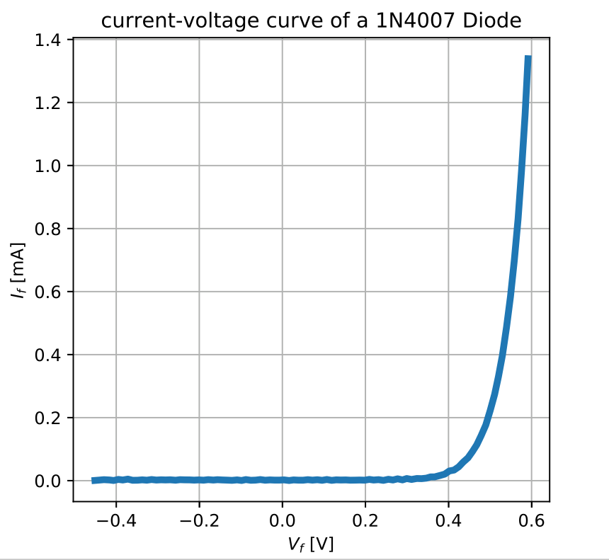
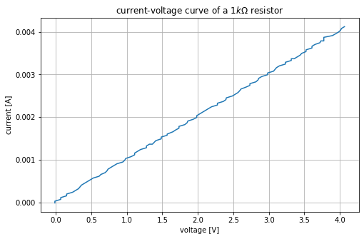

# ct-stepgen-plotting
Source control, data acquisition and plotting tool for eta Systems curve tracer using SCPI commands in Python

---

[](https://forthebadge.com)


Easily controll the tracer by sending SCPI commands over a serial COM Port

```python
from curve_tracer import curvetracer

tracer = curvetracer('COM3', 115200)
tracer.write(':SOUR:CURR:LIM ' + str(CURR_MAX))
```

### Examples

The example code produces the following curves:






